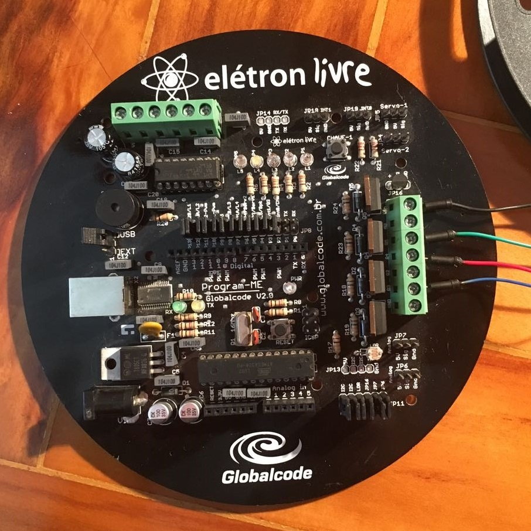

# Controle de Fita de LED RGB

#### Professor: Wilian França Costa

#### Integrantes:
- Pedro Padilha Farroco - 31825672
- Marcelo Scavone - 31835821
- Ricardo Marsiglia Junior - 31813429

## Objetivo do Trabalho

Desenvolver um projeto utilizando a plataforma [Arduino](https://www.arduino.cc) e os conceitos aprendidos em aula.

### Requisitos básicos

O trabalho deveria fazer uso de, no mínimo, um dos items a seguir:

- [ ] Utilização de servomotor

- [x] Uso do PWM

- [x] Comunicação serial

- [ ] Uso de circuito ponte H e motor-de-passo.

- [ ] Uso das entradas analogicas (conversor A/D)

## Pré-requisitos

**1. Computador:** Para executar o projeto, você precisará ter instalado no seu computador [Node.js](https://nodejs.org), que pode ser baixado clicando no link

**2. Arduino**: No Arduino, basta fazer o upload do código StandardFirmata (Em caso de dúvidas, siga o [tutorial](http://www.instructables.com/id/Arduino-Installing-Standard-Firmata/))

**3. Cérebro:** Embora não seja necessário para a execução do projeto, é bom ter conhecimentos sobre as linguagens Javascript, HTML e CSS para entender como ele funciona

## Hardware

1. Arduino

	A placa Arduino utilizada é chamada PROGRAM-ME v2.0, que é baseada no Arduino Duemilanove e foi desenvolvida pela [Globalcode](https://www.globalcode.com.br). O diferencial dela é que ela já tem, na própria placa, diversos componentes, sensores e atuadores que facilitam o desenvolvimento de projetos.

    

2. Fita de LED RGB

	

    

3. Fonte

	

4. Cabo USB

	

A fita de LED possui 4 entradas, sendo elas +12v, R, G e B.

* +12v: é ligada ao Vin do Arduino
* R, G e B: São ligadas aos transistores que, por sua vez, estão ligados à portas PWM 6, 9 e 3 do Arduino

	

## Instalação

1. Para clonar o repositório, utilize o comando a seguir:

    ```
    git clone https://github.com/pedropadilha13/circuitos.git
    ```

	Uma outra alternativa é baixar o projeto no formato zip, clicando no botão verde acima.

2. No diretório principal do projeto, utilize o comando `npm install` para fazer o download dos pacotes necessários.

3. Pronto, agora você já tem tudo para executar o projeto!

## Execução

Para executar o projeto, basta utilizar o comando ```npm run start```. Simples assim!

##### Observação: a porta padrão utilizada é a COM9. Caso o seu Arduino esteja em outra porta serial, você deve passar a porta como argumento do comando, como no exemplo a seguir:

Arduino na porta COM5: `npm run start COM5`

Você verá na tela uma mensagem dizendo que o Arduino conectou-se ao nosso programa. Depois disso, basta ir até [localhost:3000](localhost:3000) controlar sua fita de LED

## Interface de Controle

Para controlar a fita de LED, basta arrastar as barras na tela.

Ao clicar no quadrado onde as cores são mostradas, uma barra secreta aparecerá. Usando essa barra, é possível escolher cores compostas por apenas duas cores (R, G ou B).

## Como funciona

De maneira simplificada, o projeto utiliza [Johnny-Five](http://johnny-five.io) para controlar o Arduino e [socket.io](https://socket.io/) para fazer a conexão entre o browser e o servidor e enviar os valores escolhidos de um para o outro.

## License

This project is licensed under the MIT License - see [LICENSE](LICENSE) for details
